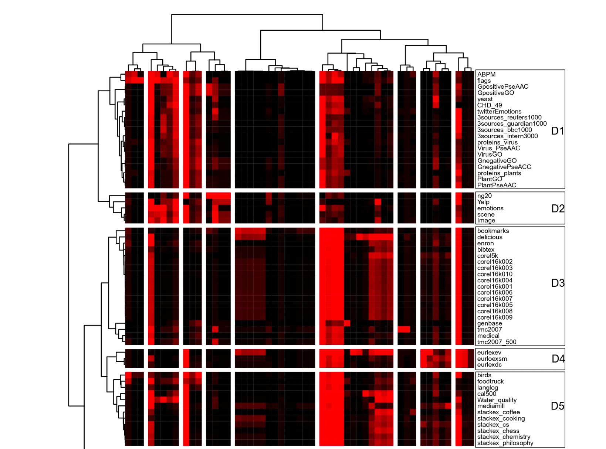

# Multi-label Classification Comprehensive Study

Multi-label classification is concerned with assigning multiple labels for a single example. The project **Multi-label Classification Comprehensive Study** is an effort to unify the existing resources
for the task of multi-label classification on tabular data. The key motivation behind this work is the expanding interest in the task due to its practical relevance and omnipresnece across domains.
One key advantage of models learned on this task is that they can compress the shared information between the multiple targets more effectivly. This results in 
smaller, and sometimes better performing models. The main domains of the task originate from text (e.g., multiple topic classification), bio-informatics (e.g., multi-cellular localization), chemistry (e.g., water composition) and others.
This project studied more than 25 methods, including more than 50 datasets and evaluated the accuracy as well as the efficiency of the MLC methods.
*The code for accessing the data, their analysis and visualizations for the three separate tasks can be found in the three folders of the project.*

The project is composed of three separate projects. They are summarized content-wise, based on the papers they were published in. The paper were published in journals within the Q1 ratings. 
The papers are listed in the following:  

* *A catalogue with semantic annotations makes multilabel datasets FAIR*, **Bogatinovski J., et al.** 2022, Scientific Reports, **(IF 4.997, h-index 206)** https://www.nature.com/articles/s41598-022-11316-3
* *Comprehensive comparative study of multi-label classification methods*, **Bogatinovski J., et al.** 2022, Expert Systems with Applications, **(IF 8.665, h-index 132)** https://www.sciencedirect.com/science/article/pii/S0957417422005991
* *Explaining the performance of multilabel classification methods with data set properties*, **Bogatinovski J., et al.**, 2022, International Journal of Intelligent Systems, **(IF 8.993, h-index 63)** https://onlinelibrary.wiley.com/journal/1098111x
* *FAIRification of MLC data*, **Bogatinovski J., et al.**, 2022, ECML-PKDD, workshop on MLC Learning, https://arxiv.org/abs/2211.12757

The MLC Dataset catalogue contains descriptions of 89 MLC datasets. Each dataset is annotated with a description of the problem the dataset is associated with and the different transformations performed. All dataset descriptions are enhanced with semantic annotations (metadata) based on classes/terms from ontologies and controlled vocabularies. The semantic annotations can be categorized into two groups: (1) Annotations of the dataset provenance information and (2) Annotations that capture the relevant machine learning characteristics of the datasets.

In addition, we held a tutorial on **Multi-label Classification at ECML PKDD 2021** (https://2021.ecmlpkdd.org/index.html@p=1705.html). The program can be found here: 
The link of the presentation is available here: https://drive.google.com/drive/folders/1B4tff9Mp3uW9Wq-nkvQj4KrOkLNF0mvY?usp=sharing. 

The MLC Dataset Catalog can be accessed at: http://semantichub.ijs.si/MLCdatasets/.
The results from the study are publicly available at one can interact with them in the following link: http://semantichub.ijs.si/MLCbenchmark/.

Other works using the content generated by this data are: 

1. *Explainable Model-specific Algorithm Selection for Multi-Label Classification*, **Kostovska et. al.,**, 2022, https://arxiv.org/abs/2211.11227 

For any information, please do contact me: jasmin <dot> bogatinovski <at> gmail <dot> com.